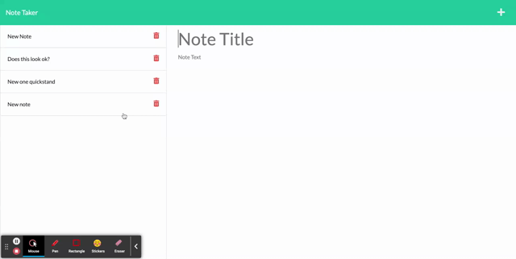

# Express-Note-Taker 

  - [Description](#description)
  - [Installation](#installation)
  - [Usage](#usage)
  - [Contributions](#contributions)
  - [Tests](#tests)
  - [Questions](#questions)
  - [License?](#license)

  ## Description
 
  Note-Taker allows the user to write and delete a note, and save it to a local json file on the server.

  ## Installation

  If you'd like to run the app locally, you can run the server by typeing: `node server` in the commandline.

  ## Contributions
  
  I am the author. If you have any questions, you can email me at the address below.

  ## Questions

  Send me and email [here](mailto:james91055@gmail.com) to contact me directly.

  ## License
  This project is licensed under the [ISC License](https://choosealicense.com/licenses/isc/) - click the link to read the license.
  
 ## Preview

 [Live Site](https://rocky-ocean-18143.herokuapp.com/)

 